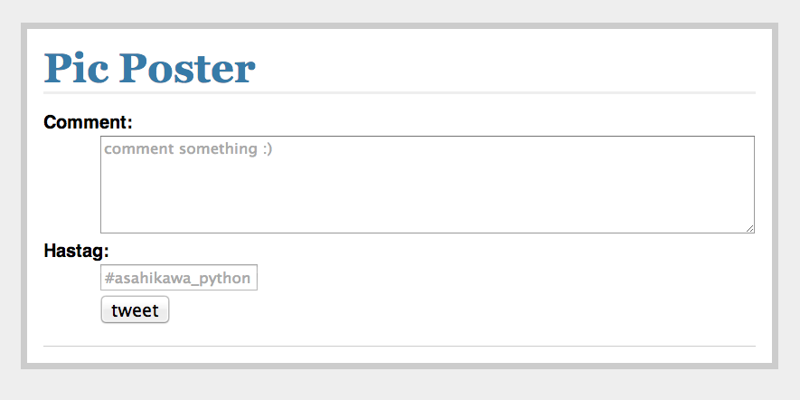

Description
------------
This is a twitter bot that will post pictures and is supposed being used in an event.

* [日本語ドキュメント](doc/ja/README.md)

How to use
----------
First, move to this `pic-poster` directory.
To run this application, command this:`python manage.py` then 
it will say this:

```python
* Running on http://0.0.0.0:5000/
* Restarting with reloader
```

and when you hit url:`http://raspberrypi's-ip-address:5000`,
this page will appear:



Here, you can write comments less than 140 charcter and 
make hashtag or ,if you don't make,
the default hashtag:`#asahikawa_python` will be taken place.

Then raspi take a photo and 
tweet the photo with the comments and hashtag you write.

To Developer
------------
to install dependcy(third-pary of python module),
you need to

```pip install -r requirements-flask.txt```

by this you will install dependcy to run web application.

and 

```pip install -r requirements-picbot.txt```

by this you will install dependcy for taking 
pictures and tweet.
In this, pygame is included.
To install pygame you need to install a lot of dependcy before

`pip install ...`

Also the working enviornments is supported only:
* Under Debian/ubuntu os.

** Note **

`settings-sample.py` is literally a sample so it doesn't not contain
settings you need for tweeting.

Create a file called `settings.py` and fill out the missing
fields.
This file should not be added to source control. It should be in `.gitignore` file.


License
-------
Redistribution and use in source and binary forms 
of the software as well as documentation,
 with or without modification,
 are permitted provided that the MIT License is met


